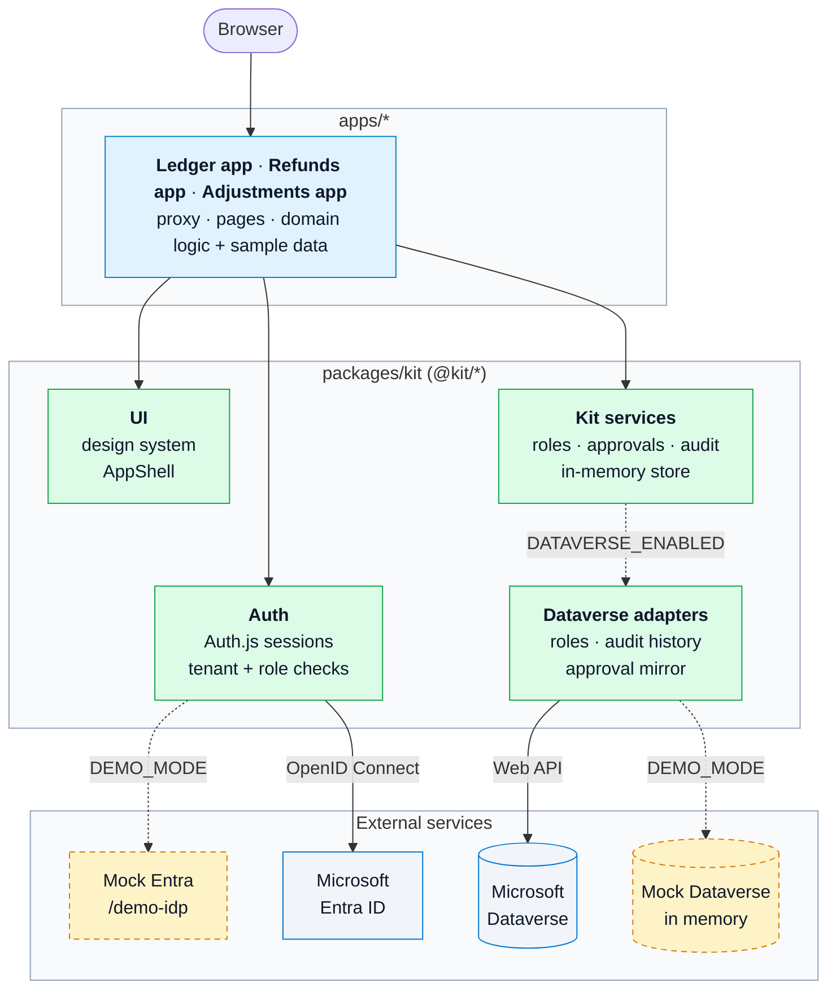
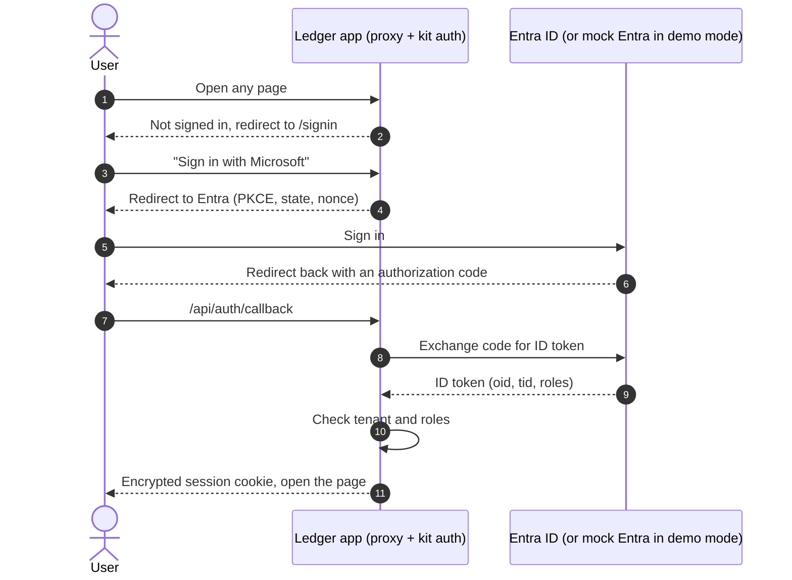

# Architecture

This repo holds internal business apps that share one foundation, the **app
kit**. There are three apps: **Ledger**, a payment ledger with maker-checker
approvals, **Refunds**, which handles customer refund requests,
approvals and issuing, and **Adjustments**, which posts customer balance
adjustments to an external PostgreSQL database after maker-checker approval. Users sign in with their company's Microsoft Entra
ID account, and what they can do depends on their role. Apps can optionally
connect to Microsoft Dataverse for roles, auditing and approvals.

```
apps/
  ledger/         The Ledger app: pages and ledger-specific logic
  refunds/        The Refunds app: pages and refund-specific logic
  adjustments/    The Adjustments app: pages, adjustment logic, Postgres schema
packages/
  kit/            Shared foundation: auth, roles, services, Dataverse, demo mode, UI
```



Solid arrows are production. Dotted arrows are optional: the Dataverse
adapters only run with `DATAVERSE_ENABLED=true`, and with `DEMO_MODE=true` the
dashed mocks take the place of Microsoft's services.

The [README](README.md) covers setup, and each workspace has its own README:
[Ledger](apps/ledger/README.md), [Refunds](apps/refunds/README.md),
[Adjustments](apps/adjustments/README.md),
[kit](packages/kit/README.md). To add an app, follow the
[`new-kit-app`](.agents/skills/new-kit-app/SKILL.md) skill.

## Apps vs. the kit

The kit holds everything that isn't specific to one app; each app only adds
its own pages and domain logic.

| | Kit (`packages/kit`) | App (`apps/<name>`) |
|---|---|---|
| Sign-in | Auth.js + Entra config, sign-in and 403 pages | Small files that point Next.js at the kit |
| Roles and access | Role hierarchy, `requireRole()` | Decides which pages need which role |
| Business services | Approvals, audit log, Dataverse adapters | Uses them in its pages |
| UI | Design system and the app shell (sidebar, header, user menu) | Its own navigation and pages |
| Demo mode | Mock Entra, mock Dataverse, demo users | Nothing extra |
| Branding | Logo and sign-in copy read from `KIT_APP_*` | Sets its name and tagline in `next.config.ts` |
| Domain logic | None | Its own types, services, summary math, sample data |

Apps import the kit as `@kit/*`, and Next.js compiles it from source, so
there is no separate build step for the kit. Next.js only finds routes and
middleware inside the app, which is why the app keeps those small pass-through
files.

## Kit services

The kit's core is a set of services, each defined as an interface:

- **Roles**: who the user is and which roles they have.
- **Approvals**: maker-checker. An Operator submits a payment, a *different*
  Approver decides, and the requester can cancel. The kit's own store is the
  source of truth.
- **Audit**: every approval action goes to the kit's audit log. With
  Dataverse on, the audit view also shows Dataverse change history.

`getKitServices()` picks the implementation behind each service from env
vars, so pages never need to know whether Dataverse or demo mode is on.

## How sign-in works



The login is accepted only if the user belongs to the tenant and, unless
Dataverse is enabled, has at least one role. Only the user's ID, tenant and
roles go into the encrypted cookie. Tokens never reach the browser.

Roles are hierarchical: `Ledger.Viewer` < `Ledger.Operator` <
`Ledger.Approver` < `Ledger.Admin`; holding a role grants every lower one.

## Run modes

Two env vars choose what the app talks to:

| | `DATAVERSE_ENABLED` off | `DATAVERSE_ENABLED=true` |
|---|---|---|
| **Normal** | Real Entra; roles from Entra app roles | Real Entra + real Dataverse; roles from Dataverse security roles |
| **`DEMO_MODE=true`** | Mock Entra | Mock Entra + in-memory mock Dataverse |

Demo mode mocks only the Microsoft services. Sign-in, sessions, tenant and
role checks, route protection, the kit services and the Dataverse adapters
all run the same code in every mode.

## Data and storage

Ledger and Refunds have no database or domain backend yet: their dashboards
show generated sample data (payments in Ledger, refund history in Refunds),
and Refunds keeps the refunds you create in memory. Without `DATABASE_URL` the
approval store and audit log are kept in memory too, so they reset on restart.

Adjustments needs `DATABASE_URL` (PostgreSQL) outside demo mode. Its customer
accounts and posted adjustments, and the kit approval store and audit log,
then live in that database through `packages/kit/sql/`. Approving an
adjustment updates the balance, writes the journal row, marks the approval and
appends the audit entries in one transaction. In demo mode it uses an
in-memory Postgres (`pg-mem`) instead. See [DEPLOYMENT.md](DEPLOYMENT.md#in-memory-state)
for what that means for hosting.

## Quality checks

`npm run lint`, `npm run typecheck`, `npm test` and `npm run build` run
across every workspace in CI. Kit tests cover auth, roles, the services, the
Dataverse adapters (against the mock organization) and the full demo sign-in
flow. Ledger tests cover the ledger math. Refunds tests cover the refund
lifecycle, RBAC, maker-checker, audit entries, summaries and CSV escaping. Adjustments tests cover
the adjustment policy, maker-checker, the Admin threshold, overdraft checks
and idempotent posting; the kit SQL tests run against `pg-mem` and, in CI, a
real PostgreSQL.
