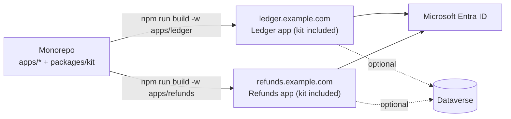

# Deployment

How apps in this repo get hosted. The repo has no hosting setup yet: CI
(`.github/workflows/ci.yml`) runs lint, typecheck, tests and build, but
nothing deploys.

## What gets deployed

Each app in `apps/` is deployed as its **own Next.js server**. The kit
(`packages/kit`) is never deployed by itself: Next.js compiles it into each
app at build time.



Build from the repo root so the kit workspace is installed:

```bash
npm ci
npm run build -w apps/<name>
npm run start -w apps/<name>   # next start, Node 24+
```

## Where it can run

| Option | Setup |
|---|---|
| **Vercel** | One Vercel project per app, root directory `apps/<name>`. Vercel's monorepo support installs the workspaces. **Not safe until approvals and the audit log move to durable storage** (see [In-memory state](#in-memory-state)). |
| **Container** (e.g. Azure Container Apps, Azure App Service) | Add `output: "standalone"` to the app's `next.config.ts` and write a Dockerfile that builds from the repo root. Fits naturally next to Entra and Dataverse. Run exactly one replica for now. |
| **Plain Node host / VM** | `npm ci && npm run build && npm start` behind a reverse proxy that terminates TLS. One process. |

## Per-app configuration

Every app has its own:

- **Hostname.** Use one subdomain per app (`ledger.example.com`,
  `refunds.example.com`). Don't run two apps on different paths of the same
  host: their Auth.js session cookies have the same default name and would
  collide.
- **Entra redirect URI.** Add
  `https://<host>/api/auth/callback/microsoft-entra-id` to the app
  registration (see [Entra app registration](apps/ledger/README.md#entra-app-registration)).
  A separate registration per app is cleaner: each app gets its own app
  roles and its own "Assignment required" user list.
- **Environment variables.** Set in the host's secret store, never committed:

| Variable | Production value |
|---|---|
| `ENTRA_TENANT_ID`, `ENTRA_CLIENT_ID`, `ENTRA_CLIENT_SECRET` | That app's registration |
| `AUTH_SECRET` | A unique random value per app (`openssl rand -base64 32`) |
| `AUTH_TRUST_HOST` | `true`, unless on Vercel or `AUTH_URL` is set (Auth.js trusts the host automatically then) |
| `DEMO_MODE` | Unset. Never `true` in production |
| `DATAVERSE_*` | Only if the app uses Dataverse (see the [kit README](packages/kit/README.md#dataverse-optional)) |

## In-memory state

This is the main blocker for real hosting.

The kit's approval store and audit log live in each server process's memory
(`packages/kit/services/services.ts`), and that store is the source of truth.
So:

- **Every restart or redeploy wipes** all approval requests and audit
  entries.
- **Instances don't share state.** On Vercel (serverless functions) or with
  more than one replica, an approval submitted on one instance doesn't exist
  on another, which breaks maker-checker.

Until this changes, the only safe setup is **exactly one always-on instance**
(min = max = 1 replica), accepting data loss on every redeploy. With
Dataverse enabled, approval status is mirrored to Dataverse, but the mirror is
not read back, so it doesn't fix this.

To allow serverless or scaling out, back the kit's approval and audit
services with durable storage (a database, or Dataverse as the source of
truth). That's a kit change, so every app gets it.

## Demo deployment

A public demo with `DEMO_MODE=true` works on a single instance with no Entra
tenant:

- Set `DEMO_IDP_URL` to the app's public origin, and `DEMO_PUBLIC_URL` if
  the browser reaches it through a different origin.
- Set `AUTH_SECRET`. Without it the kit falls back to a fixed, publicly known
  demo secret.
- The mock provider signs its authorization codes and ID tokens with an RSA
  key that each process generates on startup. So a sign-in that's in progress
  during a restart fails, and with more than one instance a sign-in fails
  whenever two of its requests reach different instances. Existing sessions
  survive restarts because their cookies are encrypted with `AUTH_SECRET`.
  Approvals and audit entries still reset on every restart.
- Never point a demo deployment at a real tenant or a real Dataverse
  environment.
